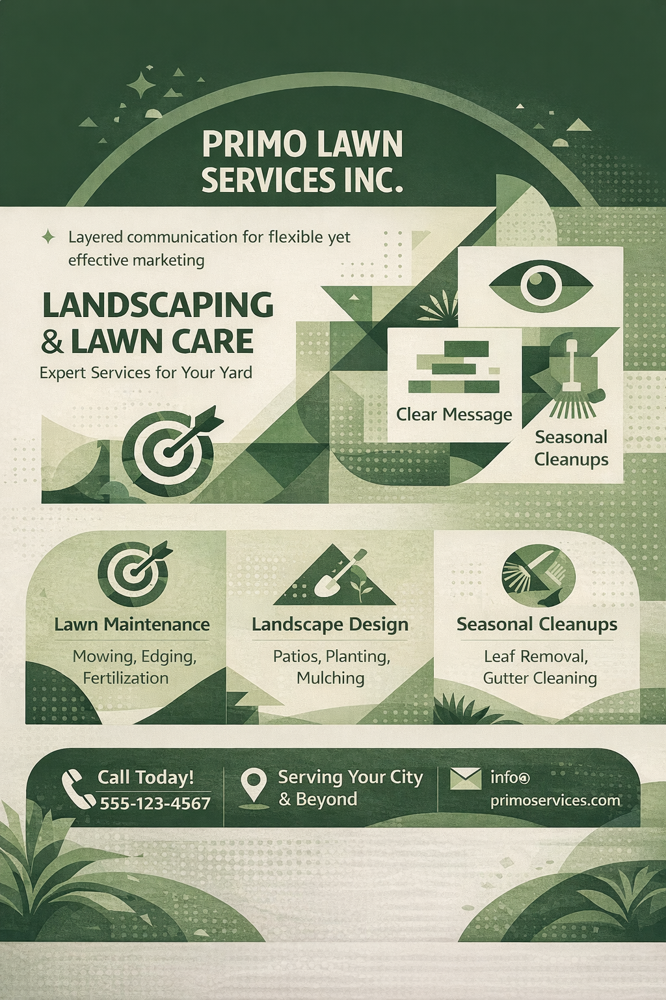

<h1>typographic-hierarchy</h1>

AI coding skill for implementing typographic hierarchy in system, ux, and document creation

<h2>setup</h2>

navigate to ai project skills folder

<ul>
  <li>Antigravity &lt;workspace-root&gt;/.agent/skills/</li>
  <li>Claude Code &lt;workspace-root&gt;/.claude/skills/</li>
</ul>
<pre><code>git clone https://github.com/RandyHaylor/typographic-hierarchy.git</code></pre>

<h2>use</h2>
<ul>
  <li>option 1: tell ai agent to use the typographic-hierarchy skill for your task</li>
  <li>option 2: update your project or global agent instructions to incorporate the typographic-hierarchy skill</li>
</ul>

<h2>Key Aspects of Typographic Hierarchy</h2>

  <em>
    Typographic hierarchy means glancers get the concept, skimmers get the cliff notes, 
    and readers get the details. Nail this, and your design can finally match your ambition.
  </em>

<ul>
  <li>Design for three reading depths: glance, skim, and deep read</li>
  <li>Higher-level elements must be independently meaningful</li>
  <li>Headlines and subheads should deliver a complete message on their own</li>
  <li>Strong hierarchy enables bold, creative layouts without sacrificing clarity</li>
  <li>Primary levels carry core meaning; deeper levels add context and nuance</li>
  <li>Each level supplements rather than replaces earlier information</li>
</ul>

<h3>Progressive Understanding by Reading Depth</h3>

<ul>
  <li>
    <strong>H1 only</strong>
    
The subject and intent are immediately clear (the takeaway for a glance).

  </li>
  <li>
    <strong>H1 + H2</strong>
    
The scope and high-level message are clear (the takeaway for a quick scan).

  </li>
  <li>
    <strong>Full content</strong>
    
Details and nuance are available for readers who choose to engage deeper.

  </li>
</ul>

